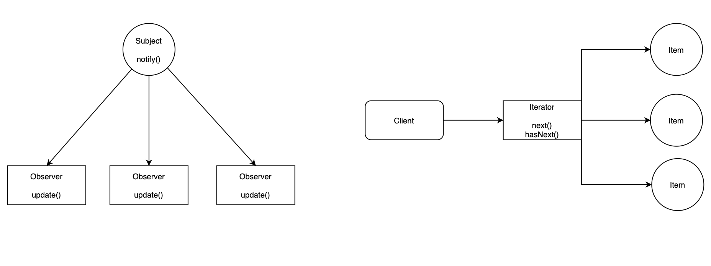

---

layout: yandex2

style: |
    /* собственные стили можно писать здесь!! */

    #observer-iterator img {
        width: 100%;
        margin-top: 50px;
    }


---

# {:.logo}

## {{ site.presentation.title }}
{:.title}

### {{ site.presentation.service }}



{:.nda}


<div class="authors">

<p>{{ site.author.name }}, {{ site.author.position }}</p>



<p>{{ site.author2.name }}, {{ site.author2.position }}</p>


</div>

## Вспомним о Promise

{:.next#question}
- ...Соответсвует одной асинхронной операции
- ...Позволяет обработать результат асинхронной операции

## Observer + Iterator = Observable

{:.images #observer-iterator}


## Promise и Observable

```js
const promise = new Promise((resolve, reject) => {/* some code */})
```

```js
const observable = new Observable(({next, complete, error}) => {/* some code */})
```

|                                            |  Promise   |  Observable |
+--------------------------------------------|------------|-------------+
|  Обрабатывает значение в случае успеха     |  resolve   |  next       |
|  Обрабатывает значение в случае ошибки     |  reject    |  error      |
|  Сигнализирует о завершении                |  resolve   |  complete   |


## Пример Observable

```js
const observable = new Observable(subscriber => {
  subscriber.next(1);
  subscriber.next(2);
  subscriber.next(3);
  setTimeout(() => {
    subscriber.next(4);
    subscriber.complete();
  }, 1000);
});
```

## Subscribe

```js
// code
console.log('just before subscribe');
observable.subscribe({
  next(x) { console.log(x); },
  error(err) { console.error(err); },
  complete() { console.log('done'); }
});
console.log('just after subscribe');
```
{:style="float:left;"}
```js
    // console
    just before subscribe
    1
    2
    3
    just after subscribe
    4
    done
```
## Unsubscribe

Не забываем отписываться от потоков, особенно от <b>бесконечных</b>!

```js
const observable = interval(1000);
const subscription = observable.subscribe(x => console.log(x));

subscription.unsubscribe();
```

## Контакты 
{:.contacts}



<figure markdown="1">

### {{ site.author.name }}


{{ site.author.position }}


</figure>





<figure markdown="1">

### {{ site.author2.name }}


{{ site.author2.position }}


</figure>



<!-- разделитель контактов -->
-------

<!-- left -->
<!-- - {:.skype}author -->
<!-- - {:.mail}author@yandex-team.ru -->
<!-- - {:.github}author -->

<!-- right -->
<!-- - {:.twitter}@author -->
<!-- - {:.facebook}author -->
- {:.telegram}@stromov

<!-- 

- {:.mail}author@yandex-team.ru
- {:.phone}+7-999-888-7766
- {:.github}author
- {:.bitbucket}author
- {:.twitter}@author
- {:.telegram}author
- {:.skype}author
- {:.instagram}author
- {:.facebook}author
- {:.vk}@author
- {:.ok}@author

-->
