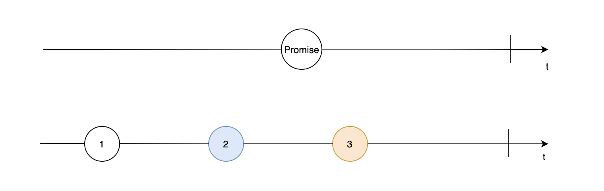
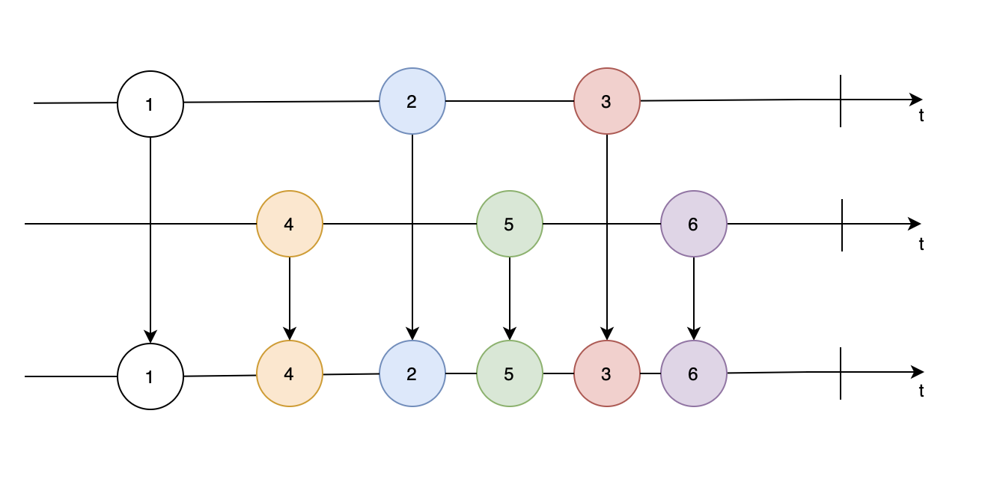
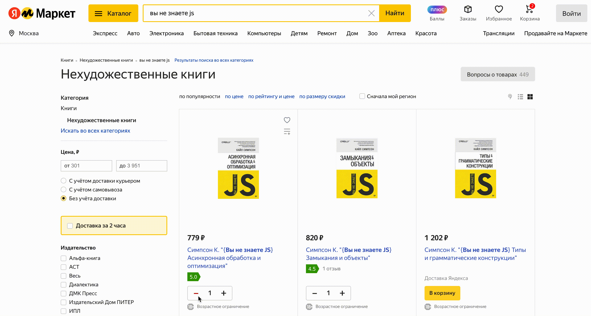
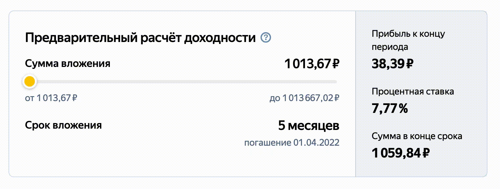
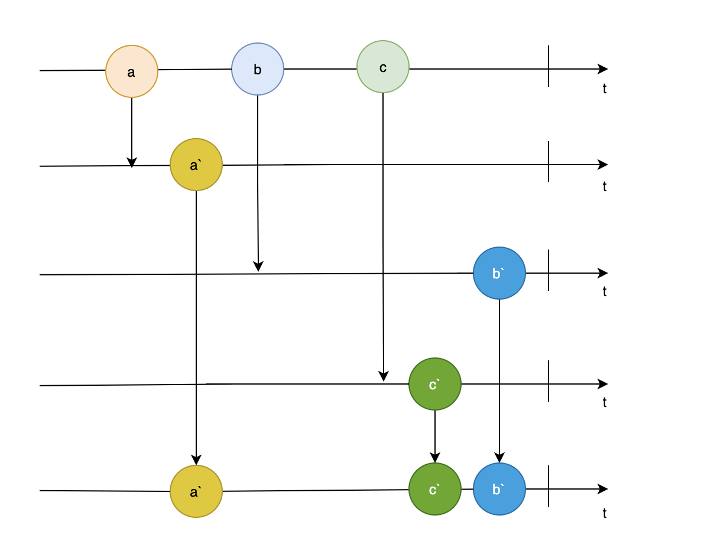
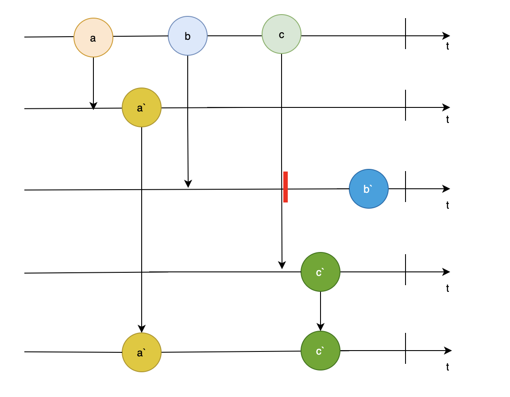
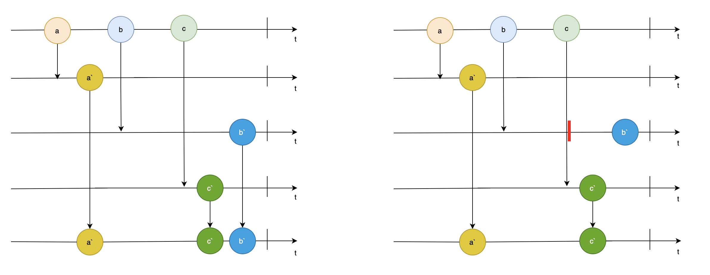

---

layout: yandex2

style: |
    /* собственные стили можно писать здесь!! */

    #full-screen img {
        width: 100%;
        margin-top: 50px;
    }

    #mergeMap img,
    #switchMap img,
    #filterGif img  {
      height: 800px;
    }

    #concat img {
      height: 700px;
    }

    #filterGif,
    #mapGif,
    #mapToGif,
    #takeGif,
    #switchMapGif,
    #mergeGif {
      display: flex;
      justify-content: center;
    }
    
    #mapChart,
    #mapToChart,
    #filterChart,
    #reduceChart,
    #takeChart,
    #distinctUntilChangedChart,
    #tapChart,
    #takeUntilChart {
      width: auto;
    }

    #takeChart img,
    #distinctUntilChangedChart img,
    #mapGif img,
    #mapToGif img,
    #takeGif img,
    #switchMapGif img,
    #mergeGif img {
      width: 100%;
    }

    #deb-and-thr img {
      width: 90%;
    }


---

# {:.logo}

## {{ site.presentation.title }}
{:.title}

### {{ site.presentation.service }}



{:.nda}


<div class="authors">

<p>{{ site.author.name }}, {{ site.author.position }}</p>



<p>{{ site.author2.name }}, {{ site.author2.position }}</p>


</div>

## Вспомним о Promise
{:.section}

## Вспомним о Promise

- Соответсвует одной асинхронной операции
- Позволяет обработать результат асинхронной операции

## Мотивация
{:.section}

## Мотивация

- Обобщение работы с идентичными асинхронными событиями
- Обработка результата асинхронного события на основе предыдущих асинхронных событий
- Прерывание

## Observable
{:.section}

## Observer + Iterator = Observable

{:.images #full-screen}


## Сигнатура

```js
const promise = new Promise(
  (resolve, reject) => {
    try {
      setTimeout(
        () => 
          resolve('result'), 
          1000
      );
    } catch (error) {
      reject(error);
    }
});
```
{:style="float:left;"}
```js
const observable$ = new Observable(
  ({next, error, complete}) => {
    next(1);
    try {
      setTimeout(() => {
        next(2);
        complete();
      }, 1000);
    } catch (error) {
      error(error);
    }
});
```
{:.image-right}

## subscribe/then error/catch

```js
promise
  .then(console.log)
  .catch(() => console.log('Error'));
```
{:style="float:left;"}
```js
observable$.subscribe(
  next(x) { console.log(x); },
  error(err) { console.error(err); },
  complete() { console.log('done'); }
);
console.log('after subscribe')
```
{:.image-right}

## Результаты Promise и Observable

```js
    // promise
    result
```
{:style="float:left;"}
```js
    // observable
    1
    after subscribe
    2
    done
```
{:.image-right}

## Promise и Observable

|                                                 |  Promise   |  Observable |
+-------------------------------------------------|------------|-------------+
|  Обрабатывает значение в случае успеха          |  resolve   |  next                  |
|  Обрабатывает значение в случае ошибки          |  reject    |  error                 |
|  Сигнализирует о завершении                     |  resolve   |  complete              |
|  Получает значение в случае успеха              |  then      |  subscribe (next)      |
|  Обработка ошибки при завершении с ошибкой      |  catch     |  subscribe (error)     |
|  Срабатывает в момент завершения                |  finally   |  subscribe (complete)  |


## Хелперы для создания Observable
{:.section}

### from, of, timer, interval, fromEvent

## from

```js
const observableFromPromise$ = from(new Promise(resolve => resolve('result')));
observableFromPromise$.subscribe(console.log);

// result
```

```js
const observableFromArray$ = from([1, 2, 3]);
observableFromArray$.subscribe(console.log);

// 1
// 2
// 3
```

## from

{:.images}


## of

```js
of(1, 2, 3).subscribe(
  next => console.log('next:', next),
  err => console.log('error:', err),
  () => console.log('the end'),
);

// next: 1
// next: 2
// next: 3
// the end
```


## of

{:.images}


## timer и interval

```js
timer(500, 1000).subscribe(console.log)

// 0
// 1
// 2
// ...
```

```js
interval(1000).subscribe(console.log)

// 0
// 1
// 2
// ...
```

## timer и interval

{:.images}


## fromEvent

```js
const clicks$ = fromEvent(document, 'click');
clicks$.subscribe(console.log);

// При клике на document выведется объект MouseEvent
```

## fromEvent

{:.images}

## Unsubscribe

Не забываем отписываться от потоков, особенно от <b>бесконечных</b>!

```js
const observable$ = interval(1000);
const subscription = observable$.subscribe(console.log);

subscription.unsubscribe();
```
## Debounce и Throttle
{:.section}

### Микропаттерны оптимизации
## Debounce и Throttle
{:.images .two #deb-and-thr}


### [Что такое Throttling и Debouncing?](https://medium.com/nuances-of-programming/что-такое-throttling-и-debouncing-4f0a839769ef)

## Как использовать Debounce и Throttle?

Подключить самостоятельно из <b>отдельного пакета</b> или <b>библиотеки</b>

```js
input.addEventListener('change', debounce(onChange, delayMs))
```
{:.next}

```js
window.addEventListener('resize', throttle(onResize, delayMs))
```
{:.next}

```js
// или использовать соответствующий оператор в RxJS
fromEvent(inputElem, 'keyup')
    .pipe(
        debounceTime(delayMs)
        // ...
    )
```
{:.next}

### [RxJS debounce vs throttle vs audit vs sample](https://dev.to/rxjs/debounce-vs-throttle-vs-audit-vs-sample-difference-you-should-know-1f21)

## Методы комбинирования потоков
{:.section}

### merge, concat

## merge

```js
merge(...observableArray$);
```

{:.images}


## merge

{:.images #mergeGif}


## concat
```js
concat(...observableArray$)
``` 

{:.images #concat}


## Обработка потока
{:.section}

### pipe, map, mapTo, filter, take, reduce, tap

## pipe

Метод pipe есть у каждого потока. Он принимает в качестве аргументов операторы для обработки потока.

```js
observable$.pipe(...someOperators);
```

## map

```js
const observable$ = from([1, 2, 3]);
const result$ = observable$.pipe(map(value => value * 10));

result$.subscribe(console.log);
```
```js
// 10
// 20
// 30
```
{:style="float:left;"}

{:.image-right #mapChart}


## map

{:.images #mapGif}


## mapTo

```js
const observable$ = from([1, 2, 3]);
const result$ = observable$.pipe(mapTo(42));

result$.subscribe(console.log);
```
```js
// 42
// 42
// 42
```
{:style="float:left;"}

{:.image-right #mapToChart}


## mapTo

{:.images #mapToGif}


## filter

```js
const observable$ = from([1, 2, 3]);
const result$ = observable$.pipe(filter(value => value % 2 === 0));

result$.subscribe(console.log);
```
```js
// 1
// 3
```
{:style="float:left;"}

{:.image-right #filterChart}


## filter

{:.images #filterGif}


## reduce

```js
const observable$ = from([1, 2, 3]);
const result$ = observable$.pipe(reduce((acc, value) => acc + value, 0));

result$.subscribe(console.log);
```
```js
// 6
```
{:style="float:left;"}

{:.image-right #reduceChart}


## take

```js
const myInterval$ = interval(1000);
const result$ = myInterval$.pipe(take(3));

result$.subscribe(console.log);
```
```js
// 0
// 1
// 2
```
{:style="float:left;"}

{:.image-right #takeChart}


## take

{:.images #takeGif}


## takeUntil

```js
const myInterval$ = interval(1000);
const clicks$ = fromEvent(document, 'click');
const result$ = myInterval$.pipe(takeUntil(clicks$));
result$.subscribe(console.log);
```
```js
// 0
// 1
// 2
```
{:style="float:left;"}

{:.image-right #takeUntilChart}


## distinctUntilChanged

```js
const observable$ = from([1, 2, 2, 3, 3, 3]);
const result$ = observable$.pipe(distinctUntilChanged());

result$.subscribe(console.log);
```
```js
// 1
// 2
// 3
```
{:style="float:left;"}

{:.image-right #distinctUntilChangedChart}


## tap

```js
const observable$ = from([1, 2, 3]);
const result$ = observable$.pipe(tap(someSideEffectFunction));

result$.subscribe(console.log);
```
```js
// 1
// 2
// 3
```
{:style="float:left;"}

{:.image-right #tapChart}


## Операторы можно объединять

```js
const observable$ = from([1, 2, 3]);
const result$ = observable$.pipe(
        map(value => value * 10),
        filter(value => value % 20),
        reduce((acc, value) => acc + value, 0)
    );

result$.subscribe(console.log);

// 40
```

## Операторы можно объединять

{:.images}


## Операторы высшего порядка
{:.section}

### mergeMap, switchMap

## mergeMap

```js
const click$ = fromEvent(document, 'click');

click$
  .pipe(
    mergeMap(event => {
      return asyncRequest({
        x: event.clientX,
        y: event.clientY
      });
    })
  )
  .subscribe(console.log);
```

## mergeMap

{:.images #mergeMap}


## switchMap

```js
const click$ = fromEvent(document, 'click');

click$
  .pipe(
    switchMap(event => {
      return asyncRequest({
        x: event.clientX,
        y: event.clientY
      });
    })
  )
  .subscribe(console.log);
```

## switchMap

{:.images #switchMap}


## switchMap

{:.images #switchMapGif}


## mergeMap и switchMap
{:.images #full-screen}



## Обрабатываем ошибки
{:.section}

### catchError

## catchError

```js
const observable$ = of(1, 2, 3);
const result$ = observable$.pipe(
  map(n => {
    if (n === 3) {
      throw new Error();
    }
    return n;
  }),
  catchError(() => of(30, 40))
);

result$.subscribe(console.log);
```
{:style="float:left;"}
```js
    // console
    1
    2
    30
    40
```
{:.image-right}

## Subject
{:.section}


## Subject
```js
const subject = new Subject();
 
subject.subscribe(console.log);
 
subject.next(1);
subject.next(2);

// 1
// 2
```

## Schedulers
{:.section}

### queueScheduler, asapScheduler, asyncScheduler, animationFrameScheduler

## Планировщики и очереди

|   Планировщик            |         Очередь              |
+--------------------------|------------------------------+
|  queueScheduler          |  синхронный код              |
|  asapScheduler           |  микрозадачи                 |
|  asyncScheduler          |  макрозадачи                 |
|  animationFrameScheduler |  перед перерисовкой контента | 

## Порядок выполнения Schedulers

```js
const queue$ = of("queueScheduler").pipe(observeOn(queueScheduler));
const asap$ = of("asapScheduler").pipe(observeOn(asapScheduler));
const async$ = of("asyncScheduler").pipe(observeOn(asyncScheduler));
const animationFrame$ = of("animationFrameScheduler").pipe(
  observeOn(animationFrameScheduler)
);
merge(async$, asap$, queue$, animationFrame$).subscribe(console.log);

// queueScheduler
// asapScheduler
// animationFrameScheduler
// asyncScheduler
```

## Сложности
{:.section}

## Сложности

- Высокий порог входа
- Тестирование (мраморные диаграммы)
- Может не подходить для проекта

### [Как тестировать observable](https://www.youtube.com/watch?v=s9FY-MBW1rc)

## Рекомендации
- [Прочитайте документацию](https://rxjs.dev/)
- Поиграйтесь в "песочнице" с примерами
- Попробуйте придумать свои примеры
- [Видео](https://youtu.be/AslncyG8whg) об очень распространённом способе использования RxJS с Redux

## Спасибо за внимание!
{:.section}

## Контакты 
{:.contacts}



<figure markdown="1">

### {{ site.author.name }}


{{ site.author.position }}


</figure>





<figure markdown="1">

### {{ site.author2.name }}


{{ site.author2.position }}


</figure>



<!-- разделитель контактов -->
-------

<!-- left -->
<!-- - {:.skype}author -->
<!-- - {:.mail}author@yandex-team.ru -->
<!-- - {:.github}author -->

<!-- right -->
<!-- - {:.twitter}@author -->
<!-- - {:.facebook}author -->
- {:.telegram}@stromov

<!-- 

- {:.mail}author@yandex-team.ru
- {:.phone}+7-999-888-7766
- {:.github}author
- {:.bitbucket}author
- {:.twitter}@author
- {:.telegram}author
- {:.skype}author
- {:.instagram}author
- {:.facebook}author
- {:.vk}@author
- {:.ok}@author

-->
